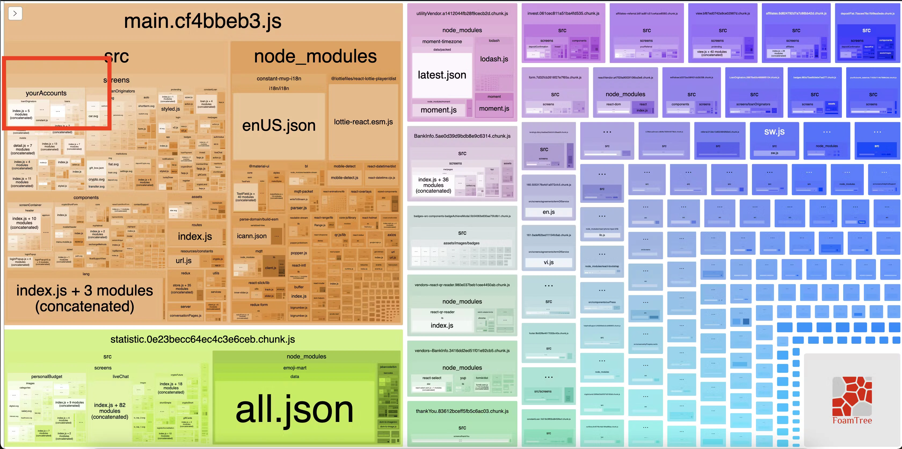
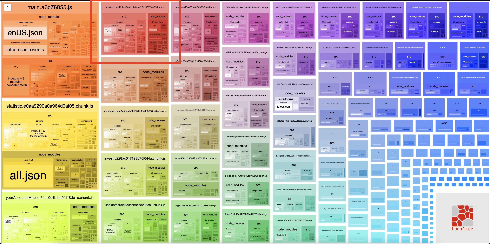

There are many articles about Code Splitting in ReactJS, as well as why we should code splitting, how we implement it,... Today, I will share my hands-on experience of applying code splitting on my real project.

## Before code splitting



As you can see in the above image, the `main` chunk is the largest one. Watch closer, there is a `yourAccounts` module inside it. In my project, there is a Home page and YourAccounts page. So I wonder, how the hell there is `yourAccounts` module in `main` chunk?

## Tracking the problem

What are we looking for? I'm looking for an `import` statement with `from` includes "yourAccounts" keyword. I start with the entry file of `main` chunk.

```plaintext
/* webpack.config.js */
entry: {
    main: './src/client.js',
},
```

Open this file, I just focus on start of the file, because almost `import` statement declared here.

```plaintext
/* src/client.js */
import React from 'react';
import ReactDom from 'react-dom';
import { BrowserRouter as Router } from 'react-router-dom';
import TagManager from 'react-gtm-module';
import { loadableReady } from '@loadable/component';

import App from 'src/app';
```

Most of them are from 3rd party, so I continue with `src/app` file. Keeping this work file by file, until I see this file.

```plaintext
/* src/routes/index.js */
import React from 'react';
import loadable from '@loadable/component';

import { URL } from 'src/resources/constants/url';
import LoadingSkeleton, { LoadingBadgeSkeleton, LoadingHomeSkeleton } from 'src/components/loadingSkeleton';
import AccountHistory from 'src/screens/yourAccounts/mobile';
import AccountHistoryDetail from 'src/screens/yourAccounts/mobile/detail';
import privateRoute from './privateRoute';
import renderRoutes from './renderRoutes';
import routeWrapper from './routeWraper';
```

Just ignore the file name, you don't need to know what it is.The point is, there are `import` statements that import file from "yourAccounts". Because of these lines, `yourAccounts` module is bundled within `main` chunk. Just simply replace those lines with dynamic import statement by [@loadable/component](https://github.com/gregberge/loadable-components)

```plaintext
/* src/routes/index.js */
const AccountHistory = loadable(() => import('src/screens/yourAccounts/mobile'));
const AccountHistoryDetail = loadable(() => import('src/screens/yourAccounts/mobile/detail'));
```

## After code splitting



Now the `yourAccounts` module is split into separate chunk, as you can see in the above image. Just a small work of my daily experience, but I hope this blog can help someone who's looking for a way to apply code splitting effectively.
